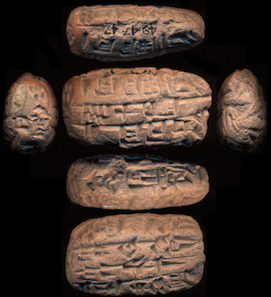

# Nino-cunei

# Cuneiform corpora in Text-Fabric

This repo is a research environment for the study of cuneiform tablets. You can
run your own programs off-line, and publish your work in online notebooks.

# Corpus

This repo contains transliterations of Old Assyrian documents (2000-1900 BC).

The data is obtained from [CDLI](https://cdli.ucla.edu), the Cuneiform Digital
Library Initiative.

See also
[about](docs/about.md)
and
[transcription](https://github.com/Nino-cunei/tfFromAtf/blob/master/docs/transcription.md).

# Software

The main processing tool is [Text-Fabric](https://github.com/annotation/text-fabric/).
It is instrumental to
turn the analysis of ancient data into computing narratives.

The ecosystem is Python and Jupyter notebooks.

# Getting started

Start with the
[tutorial](https://nbviewer.jupyter.org/github/annotation/tutorials/blob/master/oldassyrian/start.ipynb).

# Authors

This repo is joint work of

*   [Dirk Roorda](https://github.com/dirkroorda) at
    [DANS](https://www.dans.knaw.nl)
*   [J. Cale Johnson](https://www.birmingham.ac.uk/staff/profiles/caha/johnson-cale.aspx)
    at the
    [University of Birmingham](https://www.birmingham.ac.uk/schools/historycultures/departments/caha/index.aspx)
*   [Martijn Kokken](https://openaccess.leidenuniv.nl/handle/1887/45073)
    transcribed many tablets in the corpus, provided helpful feedback;
*   [Alba de Ridder](https://openaccess.leidenuniv.nl/handle/1887/68350)
    transcribed many tablets in the corpus, provided helpful feedback.

### Acknowledgements

* [Audey Hussein](https://www.linkedin.com/in/audayhussein/?originalSubdomain=ca)
  helped with the mapping from readings to cuneiform unicode;

**N.B.:** Releases of this repo have been archived at [Zenodo](https://zenodo.org).
Click the DOI badge to be taken to the archive. There you find ways to cite this work.

# Status

*   2020-06-25 First conversion to TF, with the same code as used for
    [Old Babylonian](https://github.com/Nino-cunei/oldbabylonian).
*   2018-06-19 First discussion of converting the Old Assyrian corpus
    with Alba, Martijn, en Cale during Cale's visit to Leiden.
